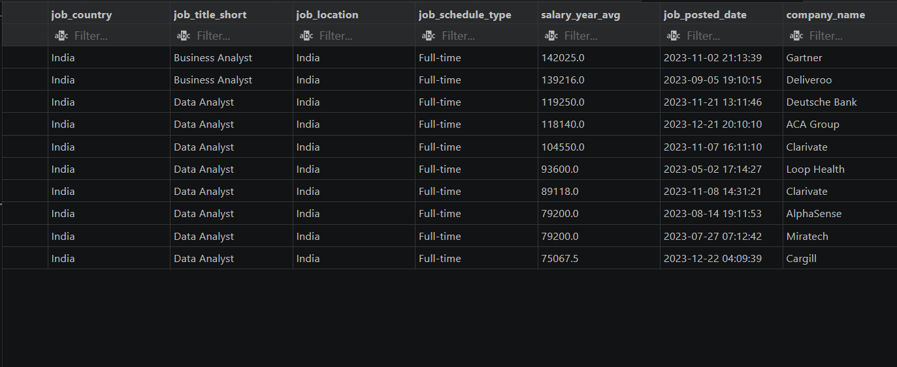
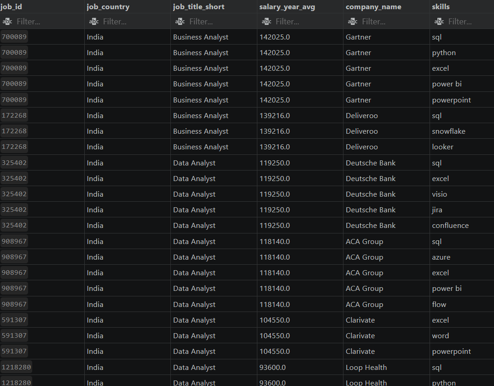

## Overview / Introduction

This project analyzes the highest-paying jobs in the data field in India, with a primary focus on Business Analyst and Data Analyst roles. The analysis explores salary trends, job demand, and the key skills required to secure these positions. The objective of this project is to identify the most valuable skills in the current market and provide insights into career opportunities within the data industry.
## SQL Queries

All SQL queries used in this project are stored in the **Project_sql.sql** folder. The queries include data exploration, analysis, and insights generation focused on high-paying jobs in the data field in India.

🔗 **SQL Queries Folder:**
[Project_sql.sql](https://github.com/k-Avi-hub/sql_load/tree/main/Project_sql.sql)
## Tools Used

**SQL:** 

Used to query, clean, transform, and analyze job market data. SQL was used to extract insights related to salary trends, job demand, and required skills for Business Analyst and Data Analyst roles.

**PostgreSQL:**

Used as the database management system to store, manage, and execute SQL queries efficiently on the dataset.

**Visual Studio Code (VS Code):**

Used as the development environment for writing, organizing, and managing SQL scripts and project files.

**Git:**

Used for version control to track project changes and maintain project history throughout development.

**GitHub:** 

Used to host the project repository, store SQL files, showcase the project portfolio, and enable project sharing and collaboration.
## Analysis

Every query in this project was designed to investigate a specific aspect of the data job market in India. The analysis focuses on identifying high-paying opportunities and understanding the skills employers value most for Business Analyst and Data Analyst roles.

---

### 1. Top Paying Jobs

This analysis focused on identifying the highest-paying jobs in the Indian data market, specifically for **Data Analyst** and **Business Analyst** roles. The query filters jobs based on location and salary availability, joins company information, and ranks positions by annual salary.

**Key Objectives:**

* Identify the highest-paying analyst roles in India.
* Compare salary levels across companies.
* Understand salary trends in the Indian data market.

**SQL Query:**

```sql
SELECT 
    job_id,
    job_country,
    job_title_short,
    job_location,
    job_schedule_type,
    salary_year_avg,
    job_posted_date,
    name AS company_name
FROM job_postings_fact
LEFT JOIN company_dim
ON job_postings_fact.company_id = company_dim.company_id
WHERE job_title_short IN ('Data Analyst', 'Business Analyst')
    AND job_location = 'India'
    AND salary_year_avg IS NOT NULL
ORDER BY salary_year_avg DESC
LIMIT 10;
```

**SQL Concepts Used:**

* SELECT
* LEFT JOIN
* WHERE Filtering
* ORDER BY
* LIMIT


---

### 2. Top Skills Required

After identifying the top-paying jobs, this analysis explored the skills required for those positions. A Common Table Expression (CTE) was used to first isolate the highest-paying jobs, followed by INNER JOIN operations to connect job postings with skill-related tables.

**Key Objectives:**

* Identify the most demanded skills.
* Understand which skills are associated with higher salaries.
* Analyze employer requirements for analyst roles.

**SQL Query:**

```sql
WITH top_paying_jobs AS (
    SELECT 
        job_id,
        job_country,
        job_title_short,
        salary_year_avg,
        name AS company_name
    FROM job_postings_fact
    LEFT JOIN company_dim
    ON job_postings_fact.company_id = company_dim.company_id
    WHERE job_title_short IN ('Data Analyst', 'Business Analyst')
        AND job_location = 'India'
        AND salary_year_avg IS NOT NULL
    ORDER BY salary_year_avg DESC
    LIMIT 10
)

SELECT
    top_paying_jobs.*,
    skills
FROM top_paying_jobs
INNER JOIN skills_job_dim
ON skills_job_dim.job_id = top_paying_jobs.job_id
INNER JOIN skills_dim
ON skills_job_dim.skill_id = skills_dim.skill_id;
```

**SQL Concepts Used:**

* Common Table Expressions (CTEs)
* INNER JOIN
* LEFT JOIN
* Multi-table Analysis
* Data Filtering

```
```
## What I Learned

This was my first SQL project and helped me build a practical understanding of how SQL is used for real-world data analysis. Through this project, I learned how to move beyond basic queries and work with structured datasets to generate meaningful insights.

### Key Learnings:

* Improved understanding of SQL query writing and database exploration.
* Learned to filter, sort, and analyze large datasets efficiently.
* Gained hands-on experience with **JOIN operations** to combine data across multiple tables.
* Understood how to use **Common Table Expressions (CTEs)** to simplify complex queries.
* Learned how to identify trends and extract business insights from raw data.
* Practiced building a complete data analysis workflow—from asking questions to generating insights.
* Developed experience using **PostgreSQL, VS Code, Git, and GitHub** for project development and version control.
* Improved problem-solving and analytical thinking through real-world job market analysis.

### Reflection

This project strengthened my foundation in SQL and gave me practical exposure to data analysis concepts. It also helped me understand how data can be transformed into actionable insights for decision-making.
